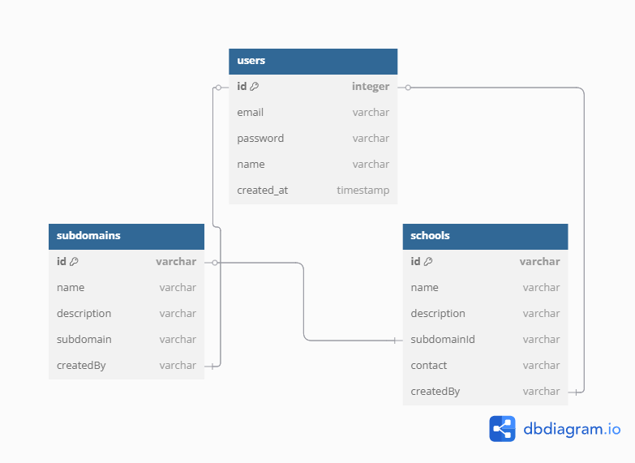

## How to Run the Project
```bash
git clone <REPO-URL>
cd multi-tenant
npm install
# Create a .env.local file in the root with the following:
# MONGODB_URI=<your_mongo_connection_string>
# NEXTAUTH_SECRET=<your_nextauth_secret>
npx auth secret
npm run dev
```
# Multi-Tenant School Platform (Next.js + Subdomains)

This project is a multi-tenant school management system built with Next.js App Router. Each school is managed under its own subdomain like `school1.localhost:3000`. Admins can register, create subdomains, configure school profiles, and manage content per subdomain, all powered by NextAuth, MongoDB, and ISR (Incremental Static Regeneration).


## Application Flow

1. **Register or log in** using email and password.
2. The **home page** displays all subdomains in a card layout.
3. **Create a new subdomain** via a modal form, validated with Zod and server actions.
4. **Configure or update** the associated school profile.
5. **Delete subdomains** (also deleting the related school data).
6. **Subdomain pages** are statically generated and revalidated automatically.
7. **Middleware** manages subdomain-based routing and authentication checks.

## Database Model



## Tech Stack

- **Next.js 14 (App Router)**: For building the application with modern React features.
- **NextAuth (JWT)**: For authentication and session management.
- **MongoDB + Mongoose**: For data storage and schema management.
- **Zod + Server Actions**: For form validation and server-side logic.
- **Tailwind CSS**: For styling the application.
- **ISR (revalidate pages for fresh data)**: For static generation and revalidation.
- **Optional: Vitest + Testing Library**: For unit testing.

